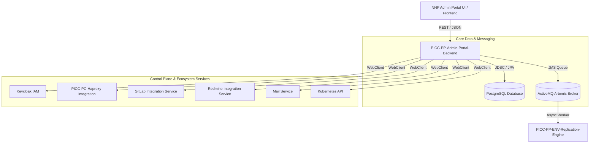

# PICC-PP-Admin-Portal-Backend

[](https://openjdk.org/projects/jdk/21/)
[](https://spring.io/projects/spring-boot)
[](https://www.postgresql.org/)
[](https://activemq.apache.org/components/artemis/)
[](LICENSE)
[]()

Enterprise Admin Portal Backend & Environment Dashboard Configurator microservice providing centralized multi-tenant environment provisioning, Keycloak IAM / RBAC synchronization, HAProxy dynamic routing inspection, tenant billing calculations, and asynchronous JMS lifecycle orchestration across the **Platform Infrastructure and Core Components (PICC)** suite of the **Nubo Native Platform (NNP)**.

---

## Table of Contents

- [Overview](#overview)
- [Key Architectural Features](#key-architectural-features)
- [Architecture & Ecosystem](#architecture--ecosystem)
- [Technology Matrix](#technology-matrix)
- [Quick Start](#quick-start)
  - [Prerequisites](#prerequisites)
  - [Configuration](#configuration)
  - [Docker Compose Execution](#docker-compose-execution)
  - [Local Execution from Source](#local-execution-from-source)
- [REST API Capabilities](#rest-api-capabilities)
- [Project Documentation](#project-documentation)
- [Repository Structure](#repository-structure)
- [Security, Code Quality & Compliance](#security-code-quality--compliance)
- [Contributing](#contributing)
- [License](#license)

---

## Overview

**`PICC-PP-Admin-Portal-Backend`** (`env-dashboard-configurator`) acts as the core control-plane backend for the NNP Admin Portal. It unifies operations across environment provisioning, user onboarding, identity management, networking ingress, and subscription accounting.

Inheriting from the platform's standardized BOM ([`PICC-PC-Abstract-NNP-Platform`](https://github.com/Nubo-Native-Platform/PICC-PC-Abstract-NNP-Platform)), the microservice enforces Java 21 LTS runtime standards, zero-hardcoded environment variable bindings, and automated DevSecOps compliance scanning.

---

## Key Architectural Features

- **Asynchronous Workflow Orchestration**: Emits and processes lifecycle events over **ActiveMQ Artemis JMS** message queues (`env-rep::env_replication`), decoupling long-running cluster provisioning tasks from interactive web requests.
- **Zero Hardcoded Configuration**: All IP addresses, external microservice endpoints, domain suffixes, and database credentials are fully externalized to environment variables with non-crashing safe defaults.
- **Identity & Access Control (Keycloak IAM)**: Automated realm, group, and user role synchronization via reactive `KeycloakClient` HTTP proxies.
- **HAProxy Route Synchronization**: Seamless integration with [`PICC-PC-Haproxy-Integration`](https://github.com/Nubo-Native-Platform/PICC-PC-Haproxy-Integration) for dynamic backend inspection and ingress route reconciliation.
- **Multi-Tenant Metering & Billing**: Comprehensive daily resource tracking, token usage metering, and billing line calculations.
- **Defense-in-Depth Log Sanitization**: All log inputs are sanitized using `Utils.sanitizeForLog()` to prevent CRLF log injection attacks.

---

## Architecture & Ecosystem



---

## Technology Matrix

| Component | Technology | Version / Specification |
| :--- | :--- | :--- |
| **Runtime Language** | Java (OpenJDK / Temurin) | 21 LTS |
| **Framework** | Spring Boot | 3.5.4 |
| **Cloud Framework** | Spring Cloud | 2025.0.0 |
| **Database** | PostgreSQL | 14+ (16 recommended) |
| **ORM / Data Access** | Spring Data JPA / Hibernate | 6.x |
| **Message Broker** | Apache ActiveMQ Artemis | JMS 2.0 |
| **HTTP Clients** | Spring WebClient (Reactive) | Netty Reactor |
| **API Documentation** | SpringDoc OpenAPI (Swagger UI) | 3.0 (OpenAPI 3.0.1) |
| **Security SAST** | SpotBugs + FindSecBugs | 4.8.6.0 / 1.13.0 |
| **SCA Security Scan** | OWASP Dependency-Check | 10.0.4 |
| **SBOM Specification** | CycloneDX | Schema 1.5 |

---

## Quick Start

### Prerequisites
- **JDK 21** installed and configured on `PATH`.
- **Docker & Docker Compose** for local services.

### Configuration
Copy the template configuration file:
```bash
cp .env.example .env
```

### Docker Compose Execution
Spin up the complete development stack (PostgreSQL, ActiveMQ Artemis, and Admin Portal Backend):
```bash
# Build and run multi-container stack
docker compose up -d

# Check container logs
docker compose logs -f admin-portal-backend
```

### Local Execution from Source
```bash
# 1. Start backing services in Docker
docker compose up -d postgres artemis

# 2. Compile and run the backend
./mvnw clean package -DskipTests
java -jar target/env-dashboard-configurator-0.0.1-SNAPSHOT.jar
```

---

## REST API Capabilities

Once running, interactive Swagger UI and OpenAPI 3.0 documentation are accessible:
- **Swagger UI**: [http://localhost:8080/swagger-ui.html](http://localhost:8080/swagger-ui.html)
- **OpenAPI Schema**: [http://localhost:8080/v3/api-docs](http://localhost:8080/v3/api-docs)

### Primary API Resource Groups
- **Environment Management** (`/env/**`): Provisioning, lifecycle states, spec templates, and component groups.
- **User Access & RBAC** (`/user/**`): Tenant onboarding, Keycloak identity provisioning, credential resets, and roles.
- **HAProxy Ingress Configs** (`/haproxy/**`): Dynamic backend inspection, route registration, and config synchronization.
- **Billing & Subscriptions** (`/admin/billing/**`): Plan definitions, metering lines, and account billing aggregation.
- **Actuator & Diagnostics** (`/actuator/**`): Health probes (`/health`), metrics (`/metrics`), and info (`/info`).

---

## Project Documentation

- 📘 [User Manual & Deployment Guide](USER_MANUAL_AND_DEPLOYMENT_GUIDE.md) — Production architecture, configuration matrix, and Kubernetes manifests.
- 🛠️ [Development Guidelines](DEVELOPMENT_GUIDELINES.md) — Coding conventions, security tooling, SpotBugs SAST, and PR checklist.
- 🤝 [Contributing Guidelines](CONTRIBUTING.md) — How to contribute, report issues, and propose enhancements.
- 📜 [Code of Conduct](CODE_OF_CONDUCT.md) — CNCF Community Code of Conduct adherence.
- 👥 [Maintainers](MAINTAINERS.md) — Core maintainers and project steering.
- 🔐 [Security Policy](SECURITY.md) — Responsible vulnerability disclosure process.

---

## Repository Structure

```
PICC-PP-Admin-Portal-Backend/
├── .github/workflows/ci-cd.yml      # CI/CD pipeline (Validate, Test, SpotBugs, SBOM, Deploy)
├── .mvn/wrapper/                    # Maven 3.9.11 wrapper
├── docker-compose.yml               # Local multi-container development environment
├── Dockerfile                       # Production Temurin 21 JRE container image
├── pom.xml                          # Maven build configuration & dependencies
├── spotbugs-exclude.xml             # SpotBugs SAST exclusion filter
├── .env.example                     # Environment configuration template
├── src/
│   ├── main/
│   │   ├── java/com/nnp/dashboard/
│   │   │   ├── client/              # Keycloak & HAProxy REST clients
│   │   │   ├── config/              # JMS, WebClient, OpenAPI, and Cache configurations
│   │   │   ├── controller/          # REST endpoints (Environment, User, HAProxy, Billing)
│   │   │   ├── model/               # JPA entities
│   │   │   ├── repo/                # Spring Data repositories
│   │   │   ├── service/             # Domain and orchestration services
│   │   │   ├── vo/                  # DTOs and view models
│   │   │   └── utils/               # Sanitization & security utilities
│   │   └── resources/
│   │       ├── application.properties
│   │       ├── application-dev.properties
│   │       ├── application-local.properties
│   │       └── application-main.properties
│   └── test/java/com/nnp/dashboard/ # Unit test suite
```

---

## Security, Code Quality & Compliance

The repository enforces strict DevSecOps gates integrated into Maven and GitHub Actions:
```bash
# Run Unit Tests
./mvnw clean test

# Run SpotBugs Static Security Analysis
./mvnw spotbugs:check

# Generate CycloneDX SBOM
./mvnw cyclonedx:makeAggregateBom
```

---

## Contributing

Contributions are welcome under the **Apache 2.0 License**. Please read [CONTRIBUTING.md](CONTRIBUTING.md) and [DEVELOPMENT_GUIDELINES.md](DEVELOPMENT_GUIDELINES.md) before submitting pull requests.

For questions and security matters, reach out to **contribution@nubons.com**.

---

## License

Licensed under the **Apache License 2.0** — see [LICENSE](LICENSE) for details.
