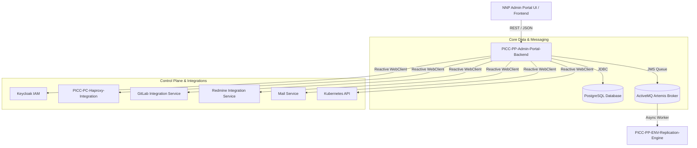

# User Manual and Deployment Guide: `PICC-PP-Admin-Portal-Backend`

**`PICC-PP-Admin-Portal-Backend`** (`env-dashboard-configurator`) is the enterprise orchestration engine and backend API service powering the **Nubo Native Platform (NNP)** administration and environment configuration portal.

---

## Table of Contents

1. [System Overview & Architecture](#1-system-overview--architecture)
2. [Prerequisites & System Requirements](#2-prerequisites--system-requirements)
3. [Configuration Reference Matrix](#3-configuration-reference-matrix)
4. [Functional Modules & Operational Workflows](#4-functional-modules--operational-workflows)
   - [Environment Lifecycle & Provisioning](#environment-lifecycle--provisioning)
   - [User Access, Roles & Keycloak IAM](#user-access-roles--keycloak-iam)
   - [HAProxy DataPlane Routing Management](#haproxy-dataplane-routing-management)
   - [Tenant Billing & Metering](#tenant-billing--metering)
   - [Asynchronous JMS Orchestration](#asynchronous-jms-orchestration)
5. [Local Development & Docker Deployment](#5-local-development--docker-deployment)
   - [Running with Docker Compose](#running-with-docker-compose)
   - [Running Natively from Source](#running-natively-from-source)
6. [Enterprise Kubernetes Deployment](#6-enterprise-kubernetes-deployment)
   - [ConfigMap & Secrets](#configmap--secrets)
   - [Deployment & Service Manifests](#deployment--service-manifests)
   - [Ingress & TLS Offloading](#ingress--tls-offloading)
7. [Observability, Health & Diagnostics](#7-observability-health--diagnostics)
8. [Troubleshooting & FAQs](#8-troubleshooting--faqs)

---

## 1. System Overview & Architecture

The Admin Portal Backend centralizes control plane operations across multi-tenant platform environments. It coordinates state transitions across relational persistence (PostgreSQL), distributed identity (Keycloak), traffic routing (HAProxy DataPlane API), GitOps repos (GitLab), issue tracking (Redmine), and notification channels (Mail Service).



---

## 2. Prerequisites & System Requirements

### Hardware Sizing Guidelines
- **Development**: 1 vCPU, 2 GB RAM.
- **Production (Small)**: 2 vCPU, 4 GB RAM.
- **Production (High Availability)**: 4 vCPU, 8 GB RAM per replica (minimum 2 replicas).

### Software Requirements
- **Runtime**: Java 21 LTS (Eclipse Temurin recommended).
- **Relational Database**: PostgreSQL 14+ (16 recommended).
- **Message Broker**: Apache ActiveMQ Artemis 2.30+ (JMS 2.0 compliant).
- **Container Engine**: Docker 24.0+ or Podman 4.5+.

---

## 3. Configuration Reference Matrix

All configuration parameters are driven via environment variables with resilient fallback defaults:

| Environment Variable | Default Value | Description |
| :--- | :--- | :--- |
| `SERVER_PORT` | `8080` | HTTP port for the Spring Boot service |
| `SPRING_PROFILES_ACTIVE` | `main` | Active profile (`main`, `dev`, `local`) |
| `SPRING_DATASOURCE_URL` | `jdbc:postgresql://localhost:5432/nnp_dashboard` | PostgreSQL JDBC connection URL |
| `SPRING_DATASOURCE_USERNAME` | `postgres` | Database authentication username |
| `SPRING_DATASOURCE_PASSWORD` | `postgres` | Database authentication password |
| `SPRING_ACTIVEMQ_BROKER_URL`| `tcp://localhost:61616` | ActiveMQ Artemis broker connection string |
| `SPRING_ACTIVEMQ_USER` | `artemis` | ActiveMQ broker username |
| `SPRING_ACTIVEMQ_PASSWORD` | `artemis` | ActiveMQ broker password |
| `KEYCLOAK_SERVICE_BASEURL` | `http://localhost:8080` | Base URL of the Keycloak identity provider |
| `HAPROXY_SERVICE_BASEURL` | `http://localhost:8081` | Base URL of the HAProxy Integration microservice |
| `HAPROXY_BASE_DOMAIN` | `nnp.example.com` | Base domain suffix for platform routing rules |
| `GITLAB_SERVICE_BASEURL` | `http://localhost:8089` | Base URL of GitLab Integration microservice |
| `REDMINE_SERVICE_BASEURL` | `http://localhost:3000` | Base URL of Redmine Integration microservice |
| `MAIL_SERVICE_BASEURL` | `http://localhost:8085` | Base URL of Mail Notification microservice |
| `K8S_API_URL` | `https://kubernetes.default.svc` | Kubernetes cluster API endpoint |
| `APP_CORS_ALLOWED_ORIGINS` | `*` | Allowed CORS origins for the frontend admin portal |
| `LOG_LEVEL` | `INFO` | Application log level (`DEBUG`, `INFO`, `WARN`, `ERROR`) |

---

## 4. Functional Modules & Operational Workflows

### Environment Lifecycle & Provisioning
1. Operators or tenants submit an environment creation request via `/env/create/v2`.
2. The service stages component specs, validates namespace isolation, and registers account bindings.
3. An asynchronous JMS event is published to `env-rep::env_replication` queue to initiate automated cluster bootstrapping.

### User Access, Roles & Keycloak IAM
- **User Onboarding**: Creates user credentials in Keycloak realms and sets up group memberships (`nnp-users`, `admins`, `users`).
- **Password Resets**: Dispatches transactional credential updates through `KeycloakClient` and sends notification emails.

### HAProxy DataPlane Routing Management
- Exposes endpoints to inspect registered backend routes (`/haproxy/configs`), register new components, and sync live HAProxy configuration files to database state.

### Tenant Billing & Metering
- Tracks daily resource consumption, computes tenant invoice lines, and aggregates billing reports.

---

## 5. Local Development & Docker Deployment

### Running with Docker Compose
To launch the service along with local PostgreSQL and ActiveMQ Artemis instances:
```bash
# 1. Create .env from template
cp .env.example .env

# 2. Build and launch all containers
docker compose up -d

# 3. View service logs
docker compose logs -f admin-portal-backend

# 4. Check Swagger UI
open http://localhost:8080/swagger-ui.html
```

### Running Natively from Source
```bash
# Start backing databases in Docker
docker compose up -d postgres artemis

# Package and run locally
./mvnw clean package -DskipTests
java -jar target/env-dashboard-configurator-0.0.1-SNAPSHOT.jar
```

---

## 6. Enterprise Kubernetes Deployment

### Kubernetes Deployment Manifest (`deployment.yaml`)
```yaml
apiVersion: apps/v1
kind: Deployment
metadata:
  name: picc-pp-admin-portal-backend
  namespace: nnp-core-components
  labels:
    app.kubernetes.io/name: picc-pp-admin-portal-backend
    app.kubernetes.io/part-of: nubo-native-platform
spec:
  replicas: 2
  selector:
    matchLabels:
      app: picc-pp-admin-portal-backend
  template:
    metadata:
      labels:
        app: picc-pp-admin-portal-backend
    spec:
      securityContext:
        runAsNonRoot: true
        runAsUser: 1001
        fsGroup: 1001
      containers:
        - name: backend
          image: ghcr.io/nubo-native-platform/picc-pp-admin-portal-backend:latest
          imagePullPolicy: IfNotPresent
          ports:
            - containerPort: 8080
              name: http
          envFrom:
            - configMapRef:
                name: admin-portal-config
            - secretRef:
                name: admin-portal-secrets
          resources:
            requests:
              cpu: 500m
              memory: 1Gi
            limits:
              cpu: 2000m
              memory: 2Gi
          livenessProbe:
            httpGet:
              path: /actuator/health/liveness
              port: 8080
            initialDelaySeconds: 40
            periodSeconds: 15
          readinessProbe:
            httpGet:
              path: /actuator/health/readiness
              port: 8080
            initialDelaySeconds: 20
            periodSeconds: 10
```

---

## 7. Observability, Health & Diagnostics

- **Health Check**: `GET http://localhost:8080/actuator/health`
- **Application Info**: `GET http://localhost:8080/actuator/info`
- **Prometheus Metrics**: `GET http://localhost:8080/actuator/metrics`
- **Swagger Documentation**: `GET http://localhost:8080/swagger-ui.html`
- **OpenAPI Schema**: `GET http://localhost:8080/v3/api-docs`

---

## 8. Troubleshooting & FAQs

**Q: Service fails to connect to ActiveMQ on startup.**  
Ensure `SPRING_ACTIVEMQ_BROKER_URL` points to an active Artemis broker instance (`tcp://artemis:61616`). If Artemis is unavailable, the application gracefully starts up and will reconnect when available.

**Q: Swagger UI returns 404.**  
Verify that SpringDoc is enabled and that requests are directed to `http://localhost:8080/swagger-ui.html`.
